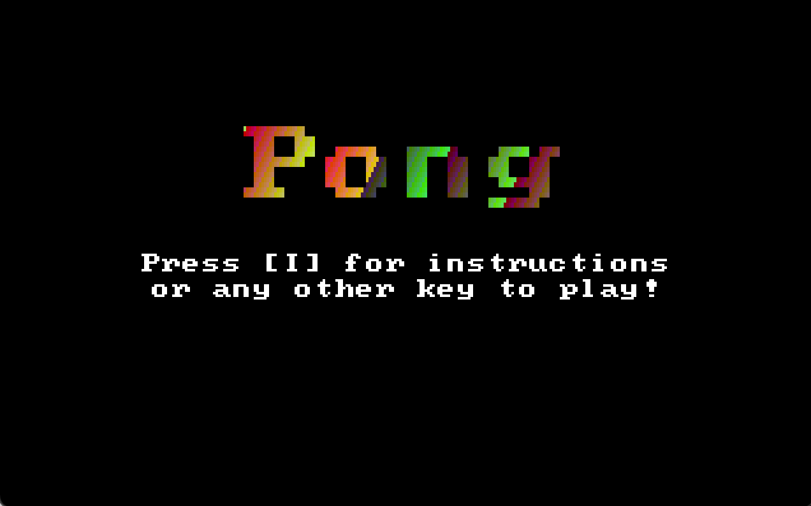
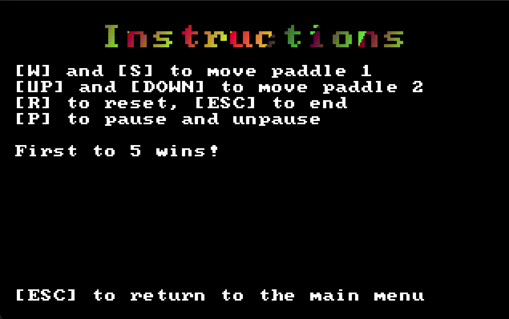
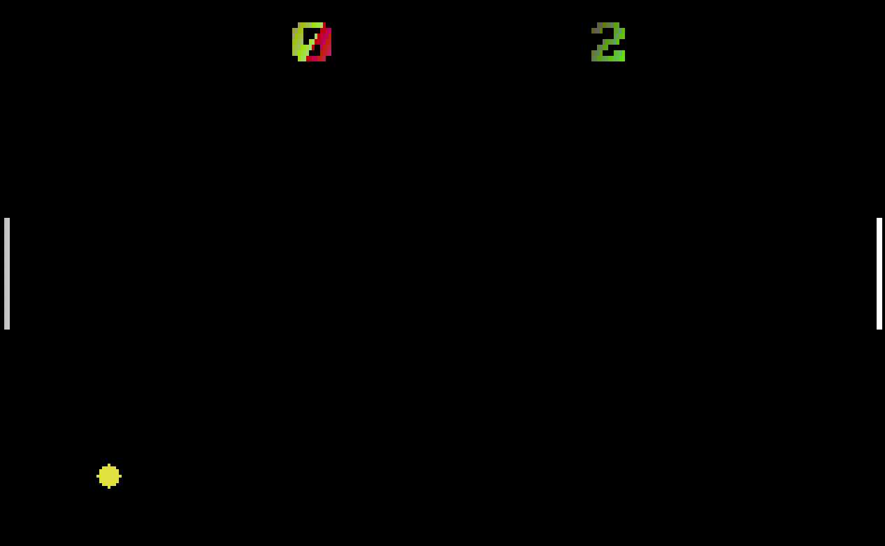
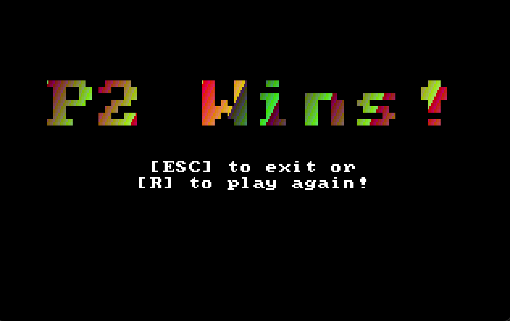
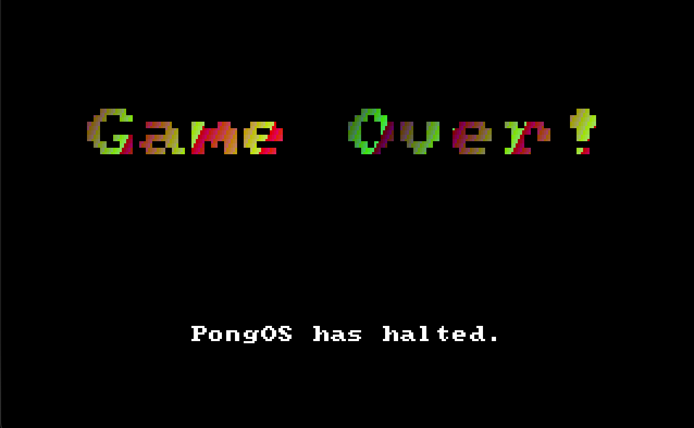

# Pong OS

*By: David*

## Overview

This is a kernel meant to run on bare metal `x86` processors for the sole purpose of playing Pong.

## Building, Running

To build the image, stay in the root directory (containing this `README`). You can then run `make clean && make -b` in order to make the image file, which will be stored in the `images` directory. Intermediate build files will be stored in the `build` directory, including object files, binaries, and intermediate disk images.

In order to run the OS, you will need to have `QEMU` to emulate a 32-bit `x86` processor. Additionally, for building and running, you will need to have `gcc`, as well as `ld`.

That being said, I've provided a prebuilt image in the images folder, and the program can be run by running `make run`. You can quit by typing `quit` in the same terminal. Note that you will still need QEMU even if you opt to use the pre-built image.

## Images

### Title

### Instructions

### Game

### Player Win

### Game Over

## Docker

In order to ensure that building works, if you want to do that, you will want to use the docker image that I've set up. If you are running on OSX (like me), the make won't run due to the OSX version of `ld` and other build tools not being compatible with certain options I've used in my makefile. So, you'll have to open up a docker container with the GNU linker, which you can do by running `docker-compose run --rm vm`. The current directory will be linked in `/home/workspace`. You can then make from there, and run in your local machine.

## Resources

I used Nick Blundell's OS development guide, which helped a ton for getting the bootsector code to function. OS-dev.org was also extremely helpful. Additionally, jdh's Tetris OS was very helpful in figuring out creating the VGA driver and other graphical elements. Lastly, vladcc's Tetris OS helped a ton when it came to interrupt handling.
